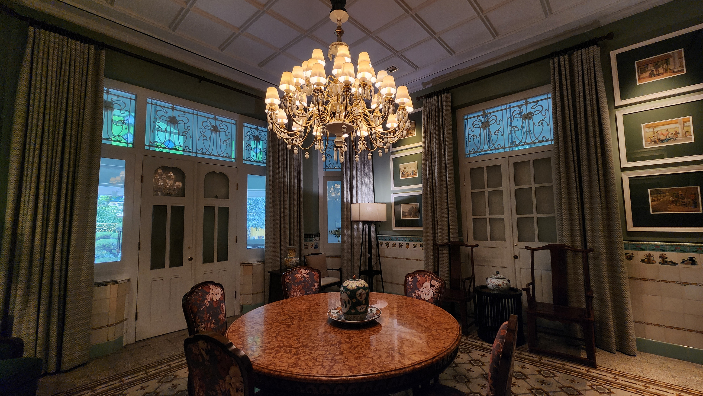
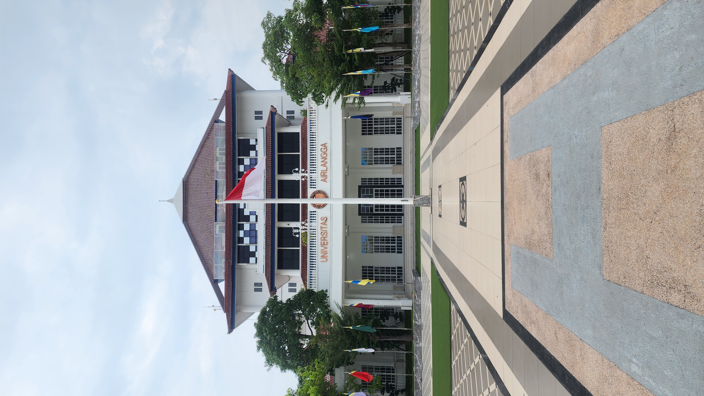
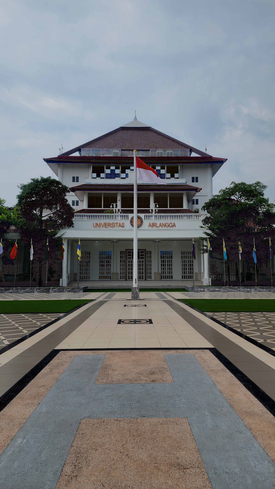

# CVL_Assignment01

## Methodology

In this project, I applied two different **pixel based gray level enhancement techniques** to improve image quality. These methods operate directly on individual pixel intensity values to generate a clearer and more visually balanced image.

### 1. Contrast Enhancement using CLAHE

To improve image contrast, I applied **Contrast Limited Adaptive Histogram Equalization (CLAHE)** using **Python** and the **OpenCV** library.

Unlike standard histogram equalization, CLAHE works on **small regions of the image called tiles**, rather than processing the entire image at once. This allows the algorithm to enhance **local contrast** while preventing excessive noise amplification.

The enhancement process is performed through the following steps:

1. The image is converted from the **BGR color space** to **LAB color space**.
2. The **L channel (lightness component)** is extracted because it represents the brightness information of the image.
3. CLAHE is applied to the **L channel** to redistribute pixel intensity values and improve local contrast.
4. The enhanced **L channel** is merged back with the **A and B channels**.
5. The image is converted back to **BGR color space** to obtain the final enhanced result.

The CLAHE algorithm uses the following parameters:

* **clipLimit = 2.0**
  Limits the contrast amplification to prevent noise from becoming too strong.

* **tileGridSize = (8, 8)**
  Divides the image into smaller regions where histogram equalization is applied locally.

This technique effectively enhances details in both **dark and bright regions** while maintaining a **natural visual appearance**.

### 2. Brightness Reduction using Linear Transformation

To correct images that appear **too bright**, I applied a **linear brightness transformation**.

This method follows the mathematical formula:

g(x)=α⋅f(x)+β

Where:

* **f(x)** represents the **original pixel value**
* **g(x)** represents the **transformed pixel value**
* **α (alpha)** controls the **contrast level**
* **β (beta)** controls the **brightness adjustment**

For this project, the following parameter values were used:

* **α = 1**
  Keeps the contrast unchanged.

* **β = -50**
  Reduces brightness by subtracting a constant value from each pixel.

This transformation was implemented using the **`cv2.convertScaleAbs()`** function from OpenCV. This function automatically ensures that the resulting pixel values remain within the valid range of **0–255**, preventing overflow or underflow errors.

By reducing the brightness level, this method helps **recover visual details that may be lost due to excessive illumination**.

## Results
Below are the comparasion between the orginal photos and the results

### 1. Contrast Enhancement:
   Before:
   
  After:
  

### 2. Brightness Reduction using Linear Transformation
   Before:
   
   After: 
   
